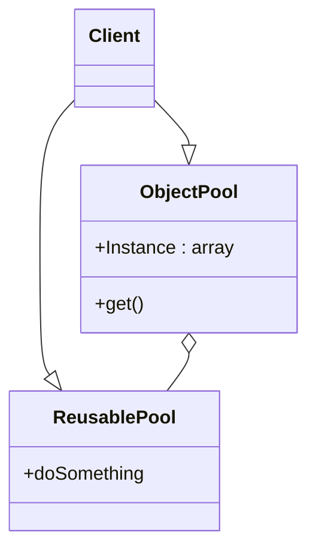

# Розрахункова-графічна робота

## з дисципліни «Архітектура та проєктування програмного забезпечення»
## на тему: «ШАБЛОНИ ПРОГРАМУВАННЯ»

# CREATIONAL PATTERN (OBJECT POOL)
## Опис шаблону:
### Шаблон пулу об’єктів – це шаблон створення програмного забезпечення, який використовується в ситуаціях, коли вартість ініціалізації екземпляра класу дуже висока. По суті, пул об’єктів – це контейнер, який містить певну кількість об’єктів. Отже, коли об’єкт взято з пулу, він недоступний у пулі, доки його не повернуть назад. [1]
### Об’єкти в пулі мають наступний життєвий цикл:
*	Створення;
*	Перевірка;
*	Знищення.

### Для шаблону ObjectPool була створена Mermaid діаграма:

### Елементи шаблону:
Клієнт: це клас, який використовує об’єкт з пулу.
ReuseablePool: об’єкт пулу є дорогим або повільним для створення екземплярів або має обмежену доступність, тому його слід зберігати в пулі об’єктів.
ObjectPool: клас Pool є найважливішим класом у шаблоні проектування пулу об’єктів. ObjectPool підтримує список доступних об’єктів і колекцію об’єктів, які вже були запрошені з пулу. [1]

### Цей шаблон використовується, коли потрібно розподілити або перерозподілити багато об'єктів; також, коли ми знаємо, що у нас є обмежена кількість об'єктів, які будуть в пам'яті одночасно.
### Переваги:
*	Значний приріст продуктивності;
*	Шаблон керує з'єднаннями і надає можливість повторного використання та спільного доступу до них;
*	Сприяє пришвидшенню розподілу об’єктів.
### Недоліки [2]:
*	Пул може витрачати пам'ять на непотрібні об'єкти;
*	Лише фіксована кількість об’єктів може бути активною в будь-який момент часу;
*	Розмір пам'яті для кожного об'єкта фіксований;
*	Невикористані об'єкти залишаться в пам'яті;
*	Повторно використані об’єкти не очищаються автоматично.
### Особливості використання:
Пул нічого не знає про реалізацію об'єктів, які зберігаються. Тому вважається, що повернений об'єкт знаходиться в невизначеному стані. Для подальшого використання його необхідно перевести в початковий стан (скидання). Наявність об'єктів в невизначеному стані перетворює Пул в «об'єктну клоаку» (object cesspool). Повторне використання може стати причиною витоку конфіденційної інформації. Тому обов'язково необхідно зчищати поля з секретними даними при скиданні, а самі дані — знищувати. [3]
### Можлива ситуація, коли в Пулі не залишиться вільних об'єктів. В такому випадку, реакція на запит може бути наступною:
#### 1.	Збільшення розміру пула;
#### 2.	Відмова у видачі об'єкта;
#### 3.	Становлення в чергу і очікування звільнення об'єкта.
### Коли ви закінчите роботу з об'єктом у пулі, ви повинні не забути покласти його назад у пул. Це звучить просто, доки ви не зрозумієте, що якщо ви забудете, то не отримаєте практично ніякого зворотного зв'язку, який би вас про це попередив. Не буде помилки компілятора або попередження, не буде надруковано логів налагодження, і гра не вилетить. Просто перезаписавши змінну, ви звільните об'єкт, на який вона посилається, і врешті-решт відбудеться збір сміття. [2]

# STRUCTURUAL PATTERN (Bridge)
## Опис шаблону:
### Шаблон проєктування Bridge призначений для «відокремлення абстракції від її реалізації, щоб вони могли змінюватися незалежно». Міст використовує інкапсуляцію, агрегацію та може використовувати успадкування для розподілу обов’язків на різні класи. [4]
Шаблон Bridge дозволяє розробляти абстракцію та реалізацію незалежно, і клієнтський код може отримати доступ лише до частини абстракції, не турбуючись про частину реалізації.
Абстракція – це інтерфейс, або абстрактний клас, а реалізатор – це також інтерфейс або абстрактний клас.
Абстракція містить посилання на реалізатор. Нащадки абстракції називаються уточненими абстракціями, а нащадки реалізатора – конкретними реалізаторами. Оскільки ми можемо змінювати посилання на реалізатор в абстракції, ми можемо змінювати реалізатор абстракції під час виконання програми. Зміни в реалізаторі не впливають на клієнтський код. Це збільшує вільний зв'язок між абстракцією класу та його реалізацією. [5]
### Для шаблону Bridge була створена Mermaid діаграма:

classDiagram   
    Abstraction --|> RefinedAbstraction
    Abstraction o-- Implementor
    Implementor <|-- ConcreteImplementor

    note for Abstraction "this.impl.implementation()"
    class Abstraction{
      -impl : Implementor
      + function()
    }
    class RefinedAbstraction{
      + refinedFunction()
    }
    class Implementor{
      +implementation()
    }
    class ConcreteImplementor{
      +implementation()
    }

### Елементи шаблону:
* Абстракція – ядро шаблону проєктування мосту, що визначає суть. Містить посилання на реалізатор.
* Уточнена абстракція – розширює абстракцію, забираючи більш дрібні деталі на один рівень нижче. Приховує більш дрібні елементи від реалізаторів.
* Реалізатор – визначає інтерфейс для класів реалізації. Цей інтерфейс не обов'язково повинен відповідати безпосередньо інтерфейсу абстракції і може дуже сильно відрізнятися. Абстракція imp забезпечує реалізацію з точки зору операцій, що надаються інтерфейсом реалізатора.
* Конкретна реалізація – реалізує вищезгаданий реалізатор, надаючи конкретну реалізацію. [5]

### Шаблон Bridge – корисний, коли і клас, і те, що він робить, часто змінюються.
### Особливості використання:
Шаблон Bridge використовується, коли:
* необхідно розділити та організувати монолітний клас, який має кілька варіантів певної функціональності (наприклад, якщо клас може працювати з різними серверами баз даних);
*	розширити клас у кількох ортогональних (незалежних) вимірах;
* потрібно мати можливість перемикати реалізації під час виконання.
Переваги:
* Можна створювати незалежні від платформи класи та програми;
* Клієнтський код працює з абстракціями високого рівня. Він не піддається впливу деталей платформи;
* Відкритий/закритий принцип. Можна вводити нові абстракції та реалізації незалежно одна від одної;
* Принцип єдиної відповідальності. Можна зосередитися на лозіці високого рівня в абстракції та на деталях платформи в реалізації.
Недоліки:
* Є ризик зробити код більш складним, застосувавши шаблон до дуже згуртованого класу. [6]

# BEHAVIORAL PATTERN (Visitor)
## Опис шаблону:
### Шаблон проєктування Visitor – це поведінковий шаблон, що дає змогу додавати до програми нові операції, не змінюючи класи об’єктів, над якими ці операції можуть виконуватися. [7]
Visitor дозволяє додавати нові віртуальні функції в родинні класи без зміни самих класів, натомість, один Visitor створює клас, який реалізує всі відповідні спеціалізації віртуальної функції. Visitor приймає посилання на елемент й реалізується шляхом подвійної диспетчеризації.
Шаблон використовується, коли:
–	існує багато об'єктів різних класів з різними інтерфейсами, і потрібно виконати операцію над цими об'єктами, залежно від їх типу.
–	потрібно виконувати над об'єктами багато непов'язаних між собою операцій, але не хочеться "забруднювати" цими операціями класи об'єктів. При цьому, якщо ці об'єкти використовуються у декількох проєктах, з'являється можливість включати операції лише в ті проєкти, де вони необхідні.
–	класи, які визначають структуру даних, змінюються рідко, але є потреба часто визначати нові операції над цією структурою. Якщо ж класи, які визначають структуру даних, змінюються часто, краще визначити операції в цих класах, адже при зміні інтерфейсів у класі даних необхідно змінювати і класи, які реалізують операції над цією структурою.
–	треба визначити операцію над деякою структурою, не змінюючи клас цієї структури. [8]

### Для шаблону Visitor була створена Mermaid діаграма:

classDiagram
    Client ..> ConcreteVisitor
    ConcreteVisitor ..|> IVisitor
    IVisitor ..> ConcreteElementA
    IVisitor ..> ConcreteElementB
    ConcreteElementA ..|> IElement
    ConcreteElementB ..|> IElement
    Client ..> IElement
    IElement ..> IVisitor
    class Client
    
    class IElement{
        accept(v: Visitor)
    }
    class ConcreteElementA{
        + featureA()
        + accept(v: Visitor)
    }
        class ConcreteElementB{
        + featureB()
        + accept(v: Visitor)
    }

    class IVisitor{
        + visit(e: ElementA)
        + visit(e: ElementB)
    }

    class ConcreteVisitor{
        + visit(e: ElementA)
        + visit(e: ElementB)
    }

### Елементи шаблону:
### Відвідувач (зазвичай, абстрактний клас чи інтерфейс):
* визначає дію над кожним класом конкретних елементів. Ім'я та сигнатура операції мають визначати конкретний клас даних, елемент якого треба відвідати. Це дає можливість відвідувачу доступатися до елементів через інтерфейс конкретного класу.
### Конкретний відвідувач (конкретний клас, що наслідує Відвідувач):
* 	реалізує чи перевизначає операції, визначені в базовому класі. Містить алгоритми, які виконуватимуться над об'єктами відповідного класу. Також даний клас утримує локальний стан алгоритмів (цей стан, зазвичай, утримує проміжні результати під час обходу структури, та ін.).
* визначає операцію, яка приймає об'єкт відвідувача як аргумент.
### Конкретний елемент (конкретний клас, що наслідує Елемент):
* визначає операцію, що приймає об'єкт відвідувача як аргумент.
### Структура елементів (клас, що реалізує структуру елементів):
* може перераховувати елементи, які містить. Надає високорівневий інтерфейс, що дозволяє відвідувачу виконувати елементи. Може бути Компонувальником чи колекцією (як список або черга). [8]

### Відвідувач описує спільний для всіх типів відвідувачів інтерфейс. Він оголошує набір методів, що відрізняються типом вхідного параметра. Кожному класу конкретних елементів повинен підходити свій метод. В мовах, які підтримують перевантаження методів, ці методи можуть мати однакові імена, але типи їхніх параметрів повинні відрізнятися.
### Конкретні відвідувачі реалізують якусь особливу поведінку для всіх типів елементів, які можна подати через методи інтерфейсу відвідувача.
### Особливості використання:
*	Visitor дозволяє застосовувати одну і ту саму операцію до об’єктів різних класів;
*	Visitor дозволяє витягти споріднені операції з класів, що складають структуру об’єктів, помістивши їх до одного класу-відвідувача. Якщо структура об’єктів використовується в декількох програмах, то шаблон дозволить кожній програмі мати тільки потрібні в ній операції;
*	Visitor дозволяє визначити поведінку тільки для цих класів, залишивши її порожньою для всіх інших.
Переваги:
*	Спрощує додавання операцій, працюючих зі складними структурами об’єктів;
*	Об’єднує споріднені операції в одному класі;
*	Може накопичувати стан при обході структури елементів.
Недоліки:
*	Патерн невиправданий, якщо ієрархія елементів часто змінюється;
*	Може призвести до порушення інкапсуляції елементів. [8]

# CONCURRENCY PATTERN (Thread-Specific-Storage)
## Опис шаблону:
### Thread-Specific-Storage (Thread-local storage) – це механізм, за допомогою якого в кожному окремому потоці виконання можуть використовуватися власні копії глобальних та статичних змінних.
Він буває корисним у деяких випадках, бо всі потоки розділяють одну і ту ж пам'ять свого процесу. Іншими словами, дані, розміщені в статичних чи глобальних змінних, зазвичай завжди розміщені в одному місці, якщо до них звертаються потоки одного процесу. Однак змінні розташовані у стеку є унікальними для потоку, оскільки кожний потік має свій стек, розміщений в окремому блоці пам'яті.
Іноді потрібно, щоб два потоки, що звертаються до якоїсь глобальної змінної, насправді звертались до різних місць в пам'яті, таким чином роблячи змінну локальною для потоку. [9]
“Кожен потік матиме власну копію змінної” [10]

### Для шаблону Thread-Specific-Storage була створена Mermaid діаграма:

classDiagram
    ApplicationThread --|> TSObjectProxy
    TSObjectProxy --|> TSObjectCollection
    TSObjectCollection o--> TSObject

    
    class ApplicationThread
    class TSObject
    
    class TSObjectProxy{
        getspecific()
        setspecific()
        key
    }
    class TSObjectCollection{
        get_object(key)
        set_object(key)
    }

### Елементи шаблону (за версією Google Gemini):
* Application Thread – відповідяє за створення колекції об’єктів.
* TS Object Proxy – є посередником між потоком програми та колекцією об’єктів, пропонуючи методи get-set потоку програми для отримання, або встановлення даних, специфічних для потоку.
* TS Object Collection – відповідає за створення об’єкта.

### Переваги:
*	Локальне сховище потоків дозволяє надати кожному запущеному потоку унікальний екземпляр класу, що є дуже цінним при спробі працювати з небезпечними класами або при спробі уникнути вимог синхронізації, які можуть виникнути через спільний стан;
*	Щодо переваги порівняно з вашим прикладом - якщо ви породжуєте один потік, використання локального сховища потоку має невелику або взагалі не має переваг перед передачею в екземплярі. ThreadLocal<T>однак подібні конструкції стають неймовірно цінними під час роботи (прямо чи опосередковано) з ThreadPool. [11]
### Особливості використання:
#### Специфічні дані потоку дозволяють потоку підтримувати власне глобальне сховище, яке приховано від інших потоків.
#### Змінюючи програму або служби програми для роботи в багатопотоковій програмі, ви повинні використовувати техніку синхронізації, щоб захистити глобальне сховище від зміни кількома потоками одночасно.
### Через дизайн програми потоки можуть працювати неправильно, якщо вони спільно використовують глобальне сховище програми. Якщо усунути глобальне сховище неможливо, вам слід розглянути можливість використання даних, що стосуються потоків.
#### Розглянемо приклад сервера, який зберігає інформацію про клієнта та поточну транзакцію в глобальному сховищі. Цей сервер ніколи не зможе обмінюватися інформацією про клієнта в багатопотоковому середовищі без суттєвої переробки. Натомість програма може передавати клієнтську інформацію від функції до функції замість використання глобальної клієнтської інформації.
#### Однак програму можна модифікувати для використання даних потоку легше, ніж її можна змінити для усунення використання глобального сховища. Коли створюється кожен новий потік, він використовує глобальний ідентифікатор (або ключ) для створення та зберігання даних, що стосуються цього потоку. Тоді кожен клієнт (потік) має унікальні, але глобальні дані клієнта.
### Крім того, деякі API надають системі можливість автоматично викликати функцію деструктора даних , яка очищає дані потоку, коли потік завершується. [12]

# СПИСОК ВИКОРИСТАНОЇ ЛІТЕРАТУРИ
1.	https://www.geeksforgeeks.org/object-pool-design-pattern/
2.	https://www.quora.com/What-are-the-benefits-and-drawbacks-of-using-Object-Pooling-in-video-games
3.	https://uk.wikipedia.org/wiki/%D0%9F%D1%83%D0%BB_%D0%BE%D0%B1%27%D1%94%D0%BA%D1%82%D1%96%D0%B2_(%D1%88%D0%B0%D0%B1%D0%BB%D0%BE%D0%BD_%D0%BF%D1%80%D0%BE%D1%94%D0%BA%D1%82%D1%83%D0%B2%D0%B0%D0%BD%D0%BD%D1%8F)
4.	https://en.wikipedia.org/wiki/Bridge_pattern
5.	https://www.geeksforgeeks.org/bridge-design-pattern/
6.	https://refactoring.guru/design-patterns/bridge
7.	https://refactoring.guru/uk/design-patterns/visitor
8.	https://uk.wikipedia.org/wiki/%D0%92%D1%96%D0%B4%D0%B2%D1%96%D0%B4%D1%83%D0%B2%D0%B0%D1%87_(%D1%88%D0%B0%D0%B1%D0%BB%D0%BE%D0%BD_%D0%BF%D1%80%D0%BE%D1%94%D0%BA%D1%82%D1%83%D0%B2%D0%B0%D0%BD%D0%BD%D1%8F)
9.	https://uk.wikipedia.org/wiki/%D0%9B%D0%BE%D0%BA%D0%B0%D0%BB%D1%8C%D0%BD%D0%B0_%D0%BF%D0%B0%D0%BC%27%D1%8F%D1%82%D1%8C_%D0%BD%D0%B8%D1%82%D0%BE%D0%BA
10.	https://java-design-patterns.com/patterns/thread-local-storage/
11.	https://stackoverflow.com/questions/2202735/what-are-the-advantages-of-instance-level-thread-local-storage
12.	https://www.ibm.com/docs/en/i/7.4?topic=techniques-data-that-is-private-thread

